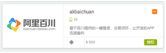

# 阿里百川接入指南
APICloud平台使用阿里百川的教程

包含入驻阿里百川，以及注册阿里妈妈的PID

##**概述**

>开发者入驻：

1、首先需要假如百川，[http://baichuan.taobao.com/](http://baichuan.taobao.com/)，按要求一步一步填写过来，成功后如下图

>阿里妈妈淘客PID：

调用SDK中淘客相关接口传入的pid参数, 如果你还没有开通阿里妈妈-淘宝联盟账号，[传送门](http://media.alimama.com/user/limit_status.htm?spm=0.0.0.0.sy9st4)。

>其他问题请联系作者邮箱(rocke@feeling.life)

[回去继续看APICloud文档](http://docs.apicloud.com/端API/开放SDK/alibaichuan)
