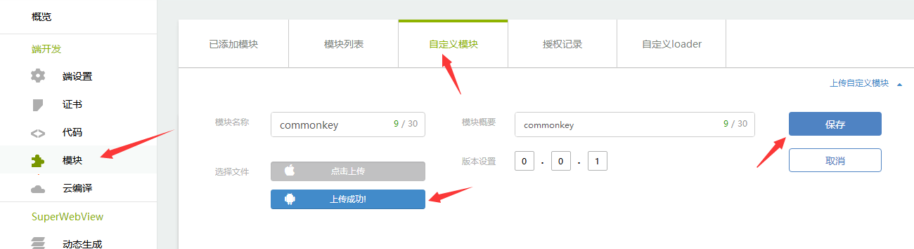
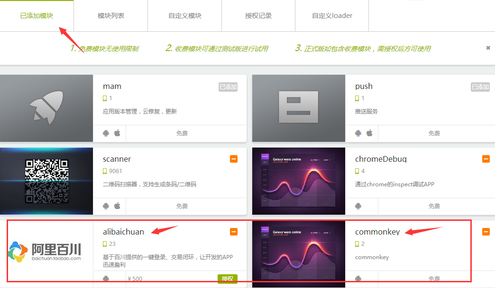
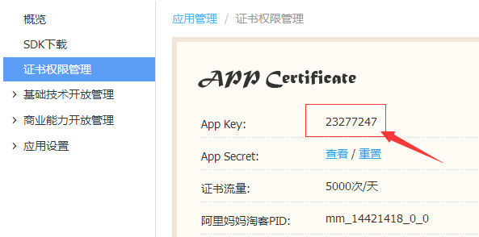
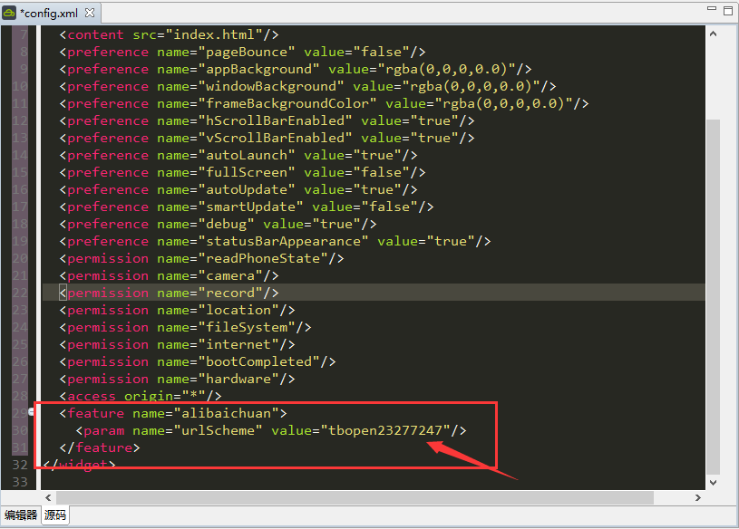
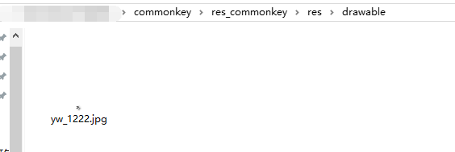
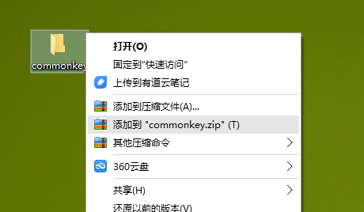

# 阿里百川接入指南

首先是效果演示，如果能满足要求，您请继续往下看


APICloud平台使用阿里百川的教程，包含入驻阿里百川，以及注册阿里妈妈的PID

因为此模块需要用到以下三个东西：

1、阿里妈妈的淘客PID

2、加入淘宝联盟，用于查看收益，并把收益转入支付宝

3、生成SDK，因为打正式包的时候需要

>指南目录


* [绑定依赖的模块](#bindyilai)

* [开始开发](#开始开发)

* [打正式包](#打正式包)

* [开发者入驻](#开发者入驻)

* [阿里妈妈淘客](#阿里妈妈淘客)

* [加入淘宝联盟](#加入淘宝联盟)

* [chrome查看log](#chrome查看log)


##**概述**

这很重要！！

测试时候请务必使用默认证书，

测试时候请务必使用默认证书，

测试时候请务必使用默认证书，

打包也打测试版而不能使用正式版，否则会报签名不一致的错误


<div id="bindyilai"></div>

#**绑定依赖的模块**<div id="bindyilai"></div>

首先需要确定，你现在是否已经生成了Android的证书，[前去查看](http://www.apicloud.com/certificate)，下图所示则说明没有生成证书


1. 如果没有，那么你可以直接下载自定义模块(androidkey.zip, iOSkey.zip), 添加到自定义模块中，调用接口进行测试，打APK包的时候选择测试版

2. 如果已经生成了证书，那么请看[打正式包](#打正式包), 如果没有，继续往下看

3、先下载阿里百川的的git压缩包，里面包含自定义模块(Alibaichuan-master.zip\Alibaichuan-master\Custom Module),


4、上传自定义模块，



5、并勾选自定义模块，能在已添加模块中看到即可



<div id="开始开发"></div>

#**开始开发**

1、手机需要安装手机淘宝，这个应该大部分人都有吧

2、接口使用参考github：[https://github.com/bringmehome/Alibaichuan](https://github.com/bringmehome/Alibaichuan/tree/master/Demo/widget),里面的测试demo

注意要在config.xml文件里添加这一句" < preference name="urlScheme" value="tbopen23277247"/ > ",其中tbopen23277247是tbopen+appkey, appkey是在阿里百川的平台上可以找到



效果




3、测试登录


4、买个东西看看，

首先，看看这个东西能返现多少钱，[传送门](http://pub.alimama.com/myunion.htm?spm=a219t.7473494.1998155389.3.ocD5gU#!/promo/self/items)

我准备买个乐高，网址https://item.taobao.com/item.htm?spm=a219t.7664554.1998457203.254.FDU0Gt&id=38922866272

填入传送门里的网址，看看98块钱，返现4.9，棒棒的


5、通过接口买了,

```js
function showTaokeItemById() {
	var param = {
		itemid : "38922866272",
		mmpid : "mm_114019109_0_0"
	};
	alibaichuan.showTaokeItemById(param, function(ret, err) {
		if (ret) {
			console.log(JSON.stringify(ret));
		} else {
			console.log(JSON.stringify(err));
		}
	});
}
```

这里教个省钱的测试方法，选中购买，到了付款界面退出，然后在去购物车找到这个订单，取消购买，

看看是否能拿到钱了，果然有了，但是是显示订单失效，当然了，你取消了嘛


给你看看成功的订单，


另外，阿里的规则（每月1号结算上一个月成功订单的返现金额，20号将钱给你，到时候你要到结算中心，把他提现转到支付宝）

<br/>
<br/>

[回去继续看APICloud文档](http://docs.apicloud.com/端API/开放SDK/alibaichuan)

<br/>
<br/>

以上都是测试时候用到的，需要打正式版本包的时候继续往下看。

<div id="打正式包"></div>

#**打正式包**

打正式包之前需要先[入驻阿里](#开发者入驻)，加入[淘宝联盟](#加入淘宝联盟)，并得到[阿里妈妈的pid](#阿里妈妈淘客)


>然后继续

1、将正式工程添加android证书，并引入百川模块，下图chromeDebug是方便调试用，不是必须，使用方法下面会介绍


2、生成APP，点击下载，到本地


3、生成SDK包，按照以下三个步骤


选择以下组件,能选的都选了吧，万一以后要用到


成功后如下图所示，下载好了后备用，然后联系作者生成自定义模块。作者邮箱(sin@feeling.life)，


从中获取的SDK，解压后得到安全图片 yw_1222.jpg，替换commonkey模块中的安全图片[commonkey模块](https://github.com/bringmehome/Alibaichuan/#bindyilai)




重新压缩自定义模块，直接在commonkey文件夹上点击压缩,并上传到自定义模块




>其他问题请联系作者邮箱(sin@feeling.life)


<div id="开发者入驻"></div>

#**开发者入驻**

1、首先需要加入百川，[http://baichuan.taobao.com/](http://baichuan.taobao.com/)，按要求一步一步填写过来，成功后如下图


<div id="阿里妈妈淘客"></div>

#**阿里妈妈淘客**

1、开通阿里妈妈会员，[http://media.alimama.com/user/limit_status.htm?spm=a219a.7395903.0.0.zr6Ni5](http://media.alimama.com/user/limit_status.htm?spm=a219a.7395903.0.0.zr6Ni5),显示以下界面则说明开通成功


2、此时再回来查看证书权限管理[http://my.open.taobao.com/](http://my.open.taobao.com/)，是不是已经有了，这个id在调用[showTaokeItemById接口](http://docs.apicloud.com/%E7%AB%AFAPI/%E5%BC%80%E6%94%BESDK/alibaichuan#6)的时候需要用到


<div id="加入淘宝联盟"></div>

#**加入淘宝联盟**

1、点此加入淘宝联盟[http://pub.alimama.com/?spm=0.0.0.0.CrMksN](http://pub.alimama.com/?spm=0.0.0.0.CrMksN)


这个和开店一样，所以需要人工审核，审核时间也有点长，一般1-2个工作日


<div id="chrome查看log"></div>

#**附录：chrome查看log**

1、打开chrome，输入chrome://inspect/#devices，就能看到制作的网页

当然页面必须包含chromeDebug模块，
```js
var chromedebug = null;
apiready = function() {
	chromedebug = api.require('chromeDebug');
	openchromelog();
};
function openchromelog() {
	chromedebug.openDebug(function(ret, err) {
		if (212 == ret.code) {
			alert(JSON.stringify(ret));
		} else {
			console.log(ret);
		}
	});
}
```


2、点击inspect，首次打开应该是白板如下


你需要翻墙了，用vpn工具翻墙，我喜欢用赛风，因为免费的嘛，


3、连接成功后，你再次点击inspect，需要等待一会，如果不行那就要多试几次，因为免费的软件总归没那么稳定。等出现以下界面，即可


